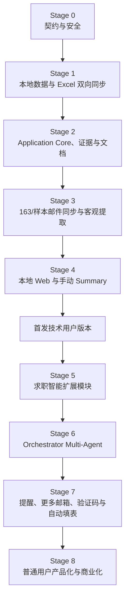

# 流程图 0：WBS 开发顺序

```mermaid
flowchart TD
    S0["Stage 0<br/>契约与安全"]
    S1["Stage 1<br/>本地数据与 Excel 双向同步"]
    S2["Stage 2<br/>Application Core、证据与文档"]
    S3["Stage 3<br/>163/样本邮件同步与客观提取"]
    S4["Stage 4<br/>本地 Web 与手动 Summary"]
    M["首发技术用户版本"]
    S5["Stage 5<br/>求职智能扩展模块"]
    S6["Stage 6<br/>Orchestrator Multi-Agent"]
    S7["Stage 7<br/>提醒、更多邮箱、验证码与自动填表"]
    S8["Stage 8<br/>普通用户产品化与商业化"]

    S0 --> S1
    S1 --> S2
    S2 --> S3
    S3 --> S4
    S4 --> M
    M --> S5
    S5 --> S6
    S6 --> S7
    S7 --> S8
```

Stage 0–4 是首发边界。后续 Stage 保留方向，进入对应阶段时再单独细化。
