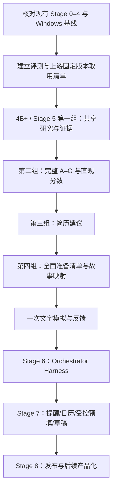

# 开发顺序

当前依据：[总体规划](../总规划/03-mvp-plan.md)。图示为后续工作，不代表已完成。

```mermaid
flowchart TD
    B[核对现有 Stage 0–4 与 Windows 基线] --> T[建立评测与上游固定版本取用清单]
    T --> F[4B+ / Stage 5 第一组：共享研究与证据]
    F --> E[第二组：完整 A–G 与直观分数]
    E --> R[第三组：简历建议]
    R --> I[第四组：全面准备清单与故事映射]
    I --> P[一次文字模拟与反馈]
    P --> O[Stage 6：Orchestrator Harness]
    O --> X[Stage 7：提醒/日历/受控预填/草稿]
    X --> D[Stage 8：发布与后续产品化]
```

每步按[统一评测](../EVALUATION.md)留下证据。H、求职信、Offer、复盘统计为候选，不是上述链路的隐含依赖。
