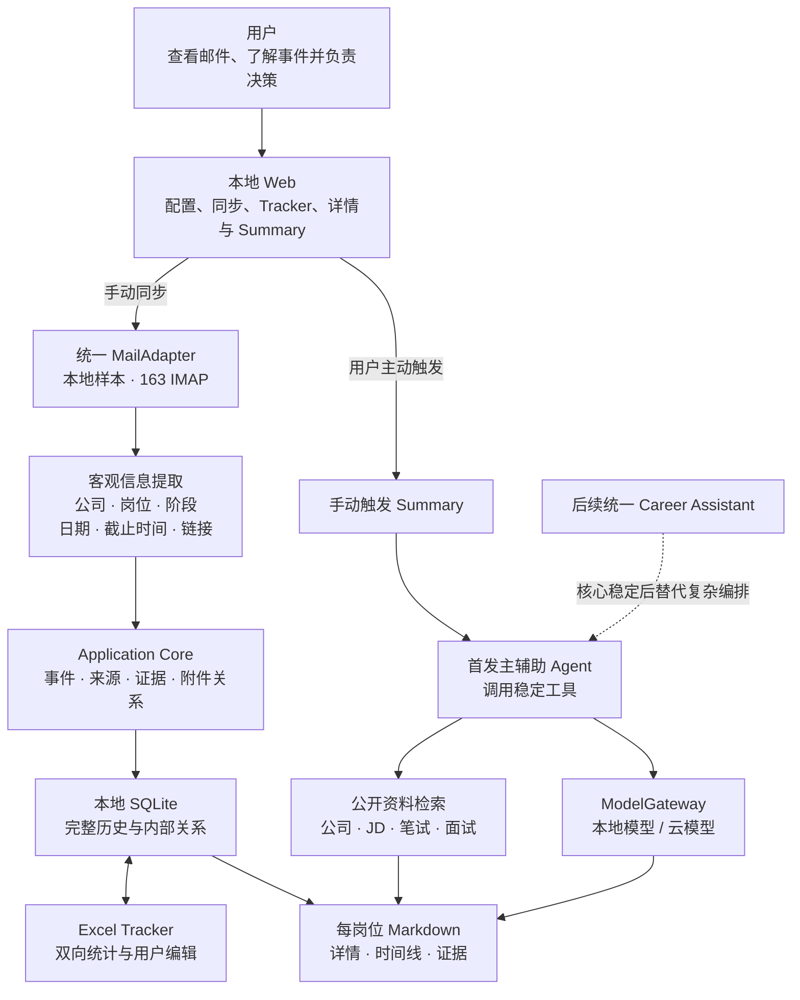

# 流程图 1：整体系统框架

```mermaid
flowchart TD
    U["用户<br/>查看邮件、了解事件并负责决策"]
    W["本地 Web<br/>配置、同步、Tracker、详情与 Summary"]
    M["统一 MailAdapter<br/>本地样本 · 163 IMAP"]
    X["客观信息提取<br/>公司 · 岗位 · 阶段<br/>日期 · 截止时间 · 链接"]
    C["Application Core<br/>事件 · 来源 · 证据 · 附件关系"]
    D["本地 SQLite<br/>完整历史与内部关系"]
    E["Excel Tracker<br/>双向统计与用户编辑"]
    P["每岗位 Markdown<br/>详情 · 时间线 · 证据"]
    T["手动触发 Summary"]
    R["公开资料检索<br/>公司 · JD · 笔试 · 面试"]
    G["ModelGateway<br/>本地模型 / 云模型"]
    A["首发主辅助 Agent<br/>调用稳定工具"]
    O["后续统一 Career Assistant"]

    U --> W
    W -->|手动同步| M
    M --> X
    X --> C
    C --> D
    D <--> E
    D --> P
    W -->|用户主动触发| T
    T --> A
    A --> R
    A --> G
    R --> P
    G --> P
    O -. "核心稳定后替代复杂编排" .-> A
```

## 核心边界

1. 用户始终知情并负责求职决策。
2. 邮件同步只做信息提取、保存和 Tracker 更新。
3. Excel 用户修改优先，不被系统静默覆盖。
4. Summary 只由用户手动触发。
5. 本地数据优先，外部调用最小化传输。
6. Multi-Agent 不阻塞首发版本。
