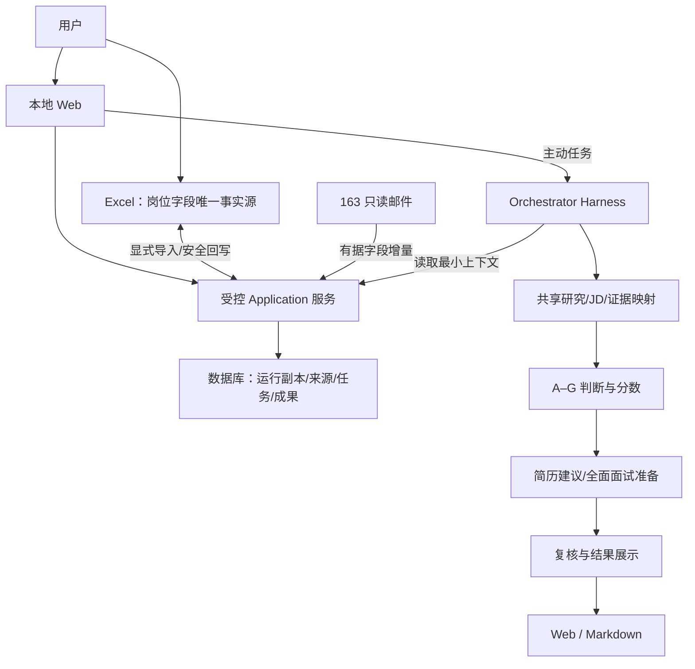

# 整体框架与数据职责

依据：[当前规则](../CURRENT-POLICY.md)与[Harness](../stages/stage-06-agent-orchestration.md)。智能模块属于后续目标。

```mermaid
flowchart TD
    U[用户] --> W[本地 Web]
    U --> E[Excel：岗位字段唯一事实源]
    W --> C[受控 Application 服务]
    E <-->|显式导入/安全回写| C
    M[163 只读邮件] -->|有据字段增量| C
    C --> D[数据库：运行副本/来源/任务/成果]
    W -->|主动任务| O[Orchestrator Harness]
    O -->|读取最小上下文| C
    O --> R[共享研究/JD/证据映射]
    R --> A[A–G 判断与分数]
    A --> S[简历建议/全面面试准备]
    S --> V[复核与结果展示]
    V --> P[Web / Markdown]
```

不自动修改简历或作外部提交。研究复用，不维护第二套岗位事实。永久删除岗位清除专属成果；未知信息不制造事实。
