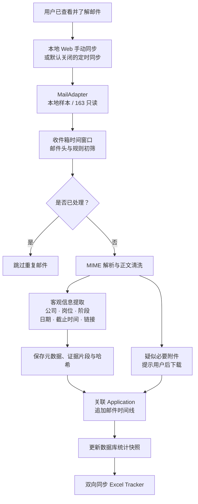

# 流程图 2：邮件到 Tracker

```mermaid
flowchart TD
    U["用户已查看并了解邮件"]
    A["本地 Web 手动同步<br/>或默认关闭的定时同步"]
    B["MailAdapter<br/>本地样本 / 163 只读"]
    C["收件箱时间窗口<br/>邮件头与规则初筛"]
    D{"是否已处理？"}
    E["跳过重复邮件"]
    F["MIME 解析与正文清洗"]
    G["客观信息提取<br/>公司 · 岗位 · 阶段<br/>日期 · 截止时间 · 链接"]
    H["保存元数据、证据片段与哈希"]
    I["关联 Application<br/>追加邮件时间线"]
    J["更新数据库统计快照"]
    K["双向同步 Excel Tracker"]
    L["疑似必要附件<br/>提示用户后下载"]

    U --> A
    A --> B
    B --> C
    C --> D
    D -->|是| E
    D -->|否| F
    F --> G
    G --> H
    H --> I
    I --> J
    J --> K
    F --> L
    L --> I
```

## 关键保护

- 邮箱只读。
- 同步不承担提醒和决策职责。
- 不明确的信息留空，不制造事实。
- 所有提取值保留来源和证据。
- 用户在 Excel 中的手工值优先。
- 邮件和附件不能修改系统指令或触发未授权操作。
