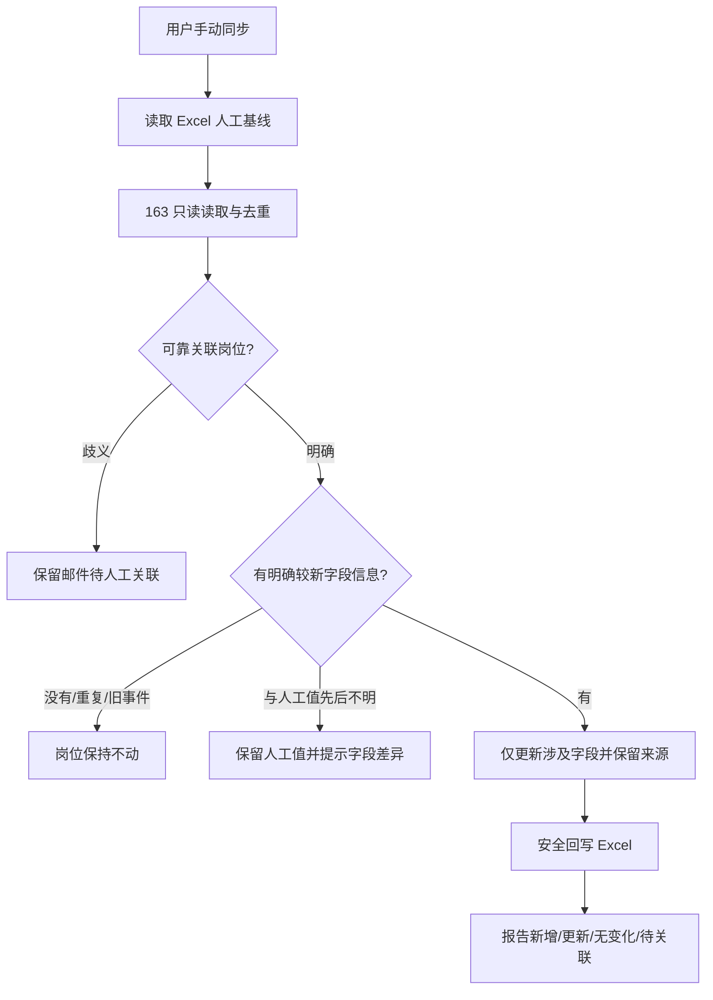

# 邮件到 Excel 的字段增量

依据：[当前规则](../CURRENT-POLICY.md)。

```mermaid
flowchart TD
    U[用户手动同步] --> E[读取 Excel 人工基线]
    E --> M[163 只读读取与去重]
    M --> A{可靠关联岗位?}
    A -->|歧义| Q[保留邮件待人工关联]
    A -->|明确| N{有明确较新字段信息?}
    N -->|没有/重复/旧事件| K[岗位保持不动]
    N -->|与人工值先后不明| H[保留人工值并提示字段差异]
    N -->|有| P[仅更新涉及字段并保留来源]
    P --> X[安全回写 Excel]
    X --> R[报告新增/更新/无变化/待关联]
```

新独立申请允许新建；缺岗位名不清空手工岗位；旧邮件不得恢复已删除岗位。Excel 完整导入缺行意味着确认后永久删除，Web 写回不能静默覆盖未导入编辑。失败明确报告，不能把邮件处理数量称为岗位更新数量。
