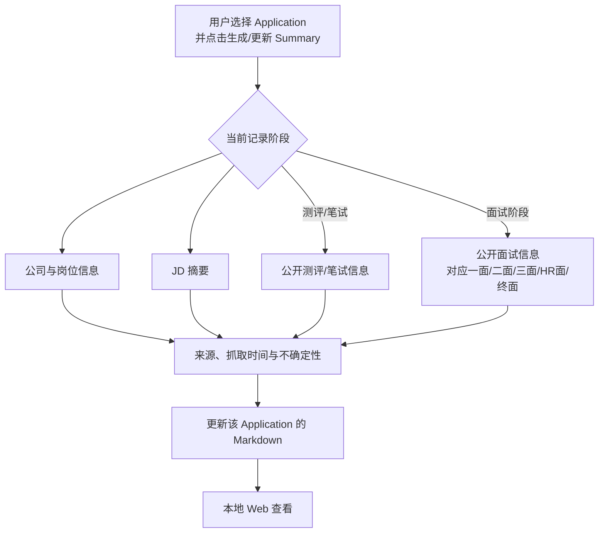

# 流程图 3：手动触发阶段 Summary

```mermaid
flowchart TD
    U["用户选择 Application<br/>并点击生成/更新 Summary"]
    S{"当前记录阶段"}
    A["公司与岗位信息"]
    J["JD 摘要"]
    O["公开测评/笔试信息"]
    I["公开面试信息<br/>对应一面/二面/三面/HR面/终面"]
    R["来源、抓取时间与不确定性"]
    M["更新该 Application 的 Markdown"]
    W["本地 Web 查看"]

    U --> S
    S --> A
    S --> J
    S -->|测评/笔试| O
    S -->|面试阶段| I
    A --> R
    J --> R
    O --> R
    I --> R
    R --> M
    M --> W
```

## 原则

- 阶段只用于选择需要整理的信息，不替用户做决策。
- Summary 不随邮件同步自动运行。
- 首发不生成模拟题、模拟面试、评分或训练计划。
- 只访问无需登录的公开信息；禁止绕过反爬和付费墙。
