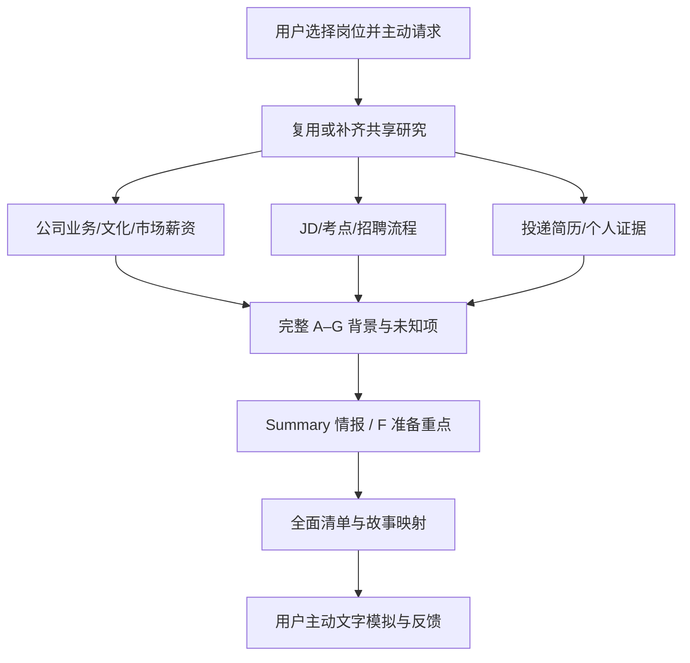

# 手动研究与全面面试准备

依据：[Stage 5](../stages/stage-05-career-intelligence-modules.md)。

```mermaid
flowchart TD
    U[用户选择岗位并主动请求] --> R[复用或补齐共享研究]
    R --> C[公司业务/文化/市场薪资]
    R --> J[JD/考点/招聘流程]
    R --> E[投递简历/个人证据]
    C --> A[完整 A–G 背景与未知项]
    J --> A
    E --> A
    A --> S[Summary 情报 / F 准备重点]
    S --> I[全面清单与故事映射]
    I --> P[用户主动文字模拟与反馈]
```

根据用户目标调用必要步骤，复用有效成果；不要求手动先走另一入口。面试类型未知不裁剪背景；局部资料缺失可继续，必须明确未知。Summary 不随邮件同步自动运行。模拟属于 Stage 5，不属于旧 Stage 4 基线。
