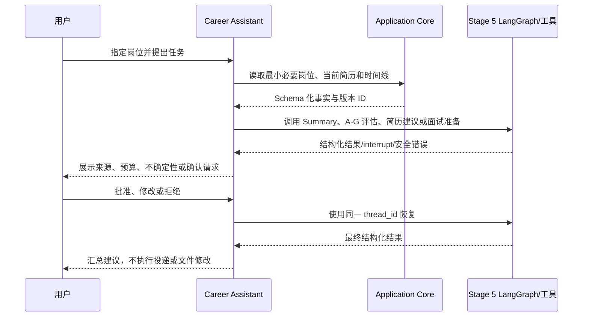

# 流程图 4：统一 Career Assistant 时序

> 本图属于 Stage 6。第一版使用一个受控 Assistant 调用稳定 Service 和 LangGraph 子图，不预建 Multi-Agent。

## 边界

- Assistant 只路由已注册工具和子图。
- Application Core 是唯一业务写入口。
- Graph 状态不保存 Secret 或无关个人数据。
- 写入报告或记录必须人工确认且保持幂等。
- 只有出现可测量瓶颈时才评估 Multi-Agent。
