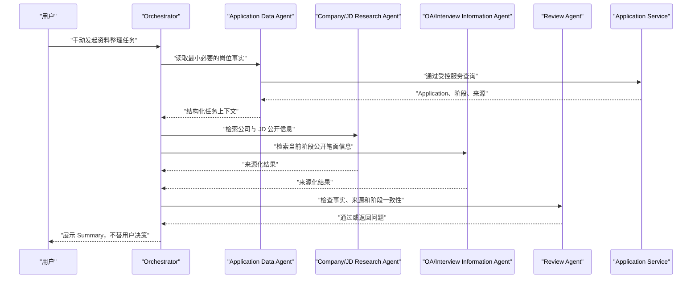

# 流程图 4：后续 Orchestrator Multi-Agent 时序

> 2026-08-01 的 Stage 6 评测结论是不引入 Multi-Agent。本图仅保留为长期条件候选；只有单 Agent 真实出现三个以上独立分支且确定性工具无法解决时才重新设计。

## Agent 边界

- Orchestrator 负责任务分配、权限、预算、超时和汇总。
- Agent 使用受控工具，不直接任意修改数据库。
- Agent 只提供记录和辅助，不替用户完成求职决策。
- Agent 之间只传最小必要的 Schema 化上下文。
