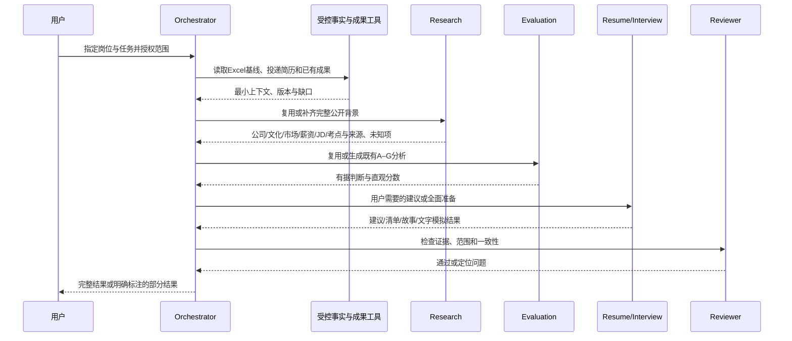

# 流程图 4：Orchestrator Harness

依据：[Harness](../stages/stage-06-agent-orchestration.md)。角色为职责边界，可先以模块实现，再按收益升级独立 Agent。

只调度本次请求所需模块，不因图中顺序强制运行全部能力；面试准备复用完整背景，缺少资料明确未知。共享研究不重复生成，权限和预算由 Orchestrator 限制；扩大授权范围时等待用户。失败恢复保留有效成果，不重复写入。
